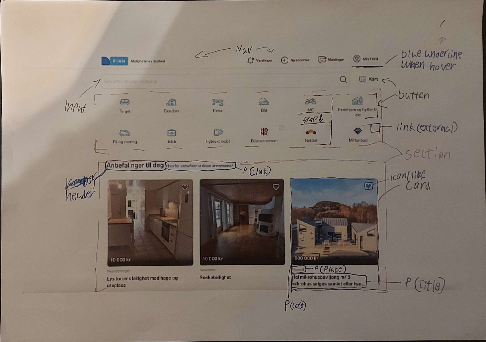

# Report

## Part 1 - Making components and demo page 

First and foremost we had to get the icons for the various pages and for that we went on the fabric site and finn and copied the svg elements and pasted them into a txt file and saved it as a .svg file so that we didn't have to deal with long strings of code that was used on the pages.
After that we split up the work, Marius making the Nav and buttons and Adrian making the inputs and cards.

### Buttons and Nav
I first started by setting up the html for the button branch making it a nav with figures inside of it, each figure a "button" having a img with the appropreate svg and a paragraph with the name having an <"a"> encompas them and linking it to the finn site's pages.
After that I made the two buttons used for the login page one marking as primary (based on the fabric site) then the flat button. and at last made the various other buttons like the info, show password eye, search button and the map button that will be places alongside the search bar later.
Then to set up the scss I started with the navigation to the other store sites buttons. First by placing them into a grid making 6 buttons pr line like the main page then using text-align to put the text and icons in the center of the buttons and made a focus outline like the real page has aswell as adding the extra external icons on the 3 last buttons using position absolute. I also added a general rule for all <"a"> as most of them would have no styling except the forgotten password and the one paragraph on the ad section on the front page
The real site has it so when you hover it would change the icon colour from blue to grey but after a lot of trial and error I couldn't get it to work reliably. I know the main page uses path stroke and fill to edit the colour but every icon is different so by editing something for one it would ruin another cause not all of the icons was alike in buildup. So if I wanted to add the effect it would require a lot of time on each and every icon.

So after finishing off with the buttons I set up a pull request on git and went to work on the top navigation menu.
Started by making a <"nav"> then inserted a unordered list having a figure with a svg img and paragraph for all of them also making sure to make the finn logo button being a separate class with -left while the other buttons had -right so I could split them up as seen on the front page (We tried making the elements as close to the final pages as possible early on to save on the time later, not to make it one to one but close).
The styling I wanted to implement was to make sure it had the blue underline and not pushing the text/icons upwards when hovering so the way to accomplish that was to have a border-bottom there always but to just have it transparent until being hovered on, that way it woul look consistant. I used flex and list style and various padding and margins aswell as gap to get some spacing. And adding the border on the bottom of the nav.

### Inputs and cards
I started by making the inputs as they were the most basic elements, specifically the search bar and login inputs. These were styled by making a .inputs class and then adding elements with the & symbol in SCSS. The base class carries the primary border styles. This removes the base borders and replaces them with thinner ones and sets them up to be further modified based on where it is to be used. I also made cards for both the sites, the one for the screenshot1 was by far the most intensive and difficult one, and ended up taking almost an entire day. They use box shadow to separate it from the background, and the one for the screenshot1 page uses a background image  in the styles to create the center image with the cost and "favorite" icon. It was difficult to figure out how to set it up, and in hindsight it's not great, the page is hardly responsive but I primarily focused on trying to use BEM & SCSS, I also used variables for all the colors in the common.scss, which worked fine, however I found it way easier to edit the opacity of the colors using a base HEX than when I have the colors stored in a variable, maybe I'm just dumb but the only way I saw how was to make a new variable with a color with less opacity, which felt like it gave me less control, but here I was just using pre-made colors from the fabric site anyway so it was fine.

## Part 2 - Setting up the pages

After having merged the branches into main some cleaning and pre work had to be done to make the page setup go as smooth as possible. First the demo page and common.scss/css file had to be cleaned up by moving various elements into categories and sections so that the code would look neet as it was kind of a mess after the merge since every branch was on top of eachother. Colour variables was inserted so that it could be used for the pages and changed the hex codes to the variables.

### Page 1 - Front page
First and foremost I copied over every element that I would need to build the page, that being:
top navigation menu, searchbar input, map button, page navigation and front page cards.
Having all these elements I made a id for the front page content and placed it on the body so my edits wouldn't overlap with Adrians ones then I jumped over to style.scss and made the few but important changes.
First was connecting the common.scss file with @use and then fixing the top navbar to be correct, removing the general margin that was used on the demo page. After that there was just som general fixes making the buttons of the top nav to be the generall correct size and fixing the spacing to look better. Something that I still can't figure out is some random a elements showing up in the live server that isn't in the code, but this doesn't seem to get in the way of the look so I let that headache be.
Then the next part was the main section so I started off by making it display flex and centering all of the content to the center. After that the next on the menu was the searchbar. Adrian had made the input element and I had to fix the bem for my searchBar elements as I tought the first block was searchBar but it seemed to be input and after fixing that I worked on adding the search button to the text input, but after several tries to make it work I had to just keep it out and keep the image icon that Adrian had made as playing with positioning was headache because of the screen sizes. I made a class with the name of Flex to add for all of the small flex elements like making the input and map button line up aswell as the H1 element with the paragraph later on and the 3 cards.
I had to do some small changes to the nav icon menu as it was a bit too big. Then at last I separated the card section into two, 1st having the text elements on top while the 2nd be the cards. Then at last i had to fix the ad link to be blue and fix the image on the card, using a random cat image that Adrian had added to the demo, changed some of the text boxes and cost. The image could be pretty much anythin as it was done in the common.scss file so that images are intechangable and keep the same form and size. 

### Page 2 - Login page
I used the elements we had made in the demo.html and common.scss and ported them over, afterwards I added display flex and direction row to line up the elements as I only had two cards, I put that in a class in the style.scss and one for the background color since it's different from screenshot1's background. I then proceeded to work on the two cards, the left one with the phone image was relatively simple to set up but I had some issues with the text not sitting correctly. This was fixed by adding flex to the container, somehow that made the phone image massive, that was again fixed by moving the flex onto only the text container and not the entire container with the image in it. The card on the right on the other hand was a lot more difficult, I wanted to use a form but wasn't able to make it work so I used divs instead to set it up, I wasn't able to get the right icons from the fabric site so I had to use the ones I was able to get, I added the hover background functionality to the info button and wanted it on the checkbox and eye too, but the checkbox I wasn't able to target at all. I'm not sure how to do it, I believe I might have to target the input tag but after spending hours on it I just had to move on. Then I fixed the link stylings since the base links are styled differently on the other page, which messed up mine, but using a span and editing them back fixed it. I tried to overall use the right colors etc. from the fabric site, and did my best to make the page look good.

